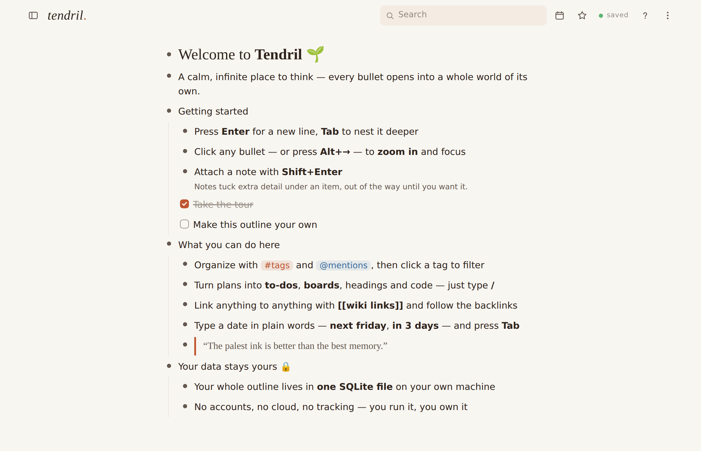

<h1 align="center">Rhizome 🌱</h1>

<p align="center"><b>A calm, page-based outliner that's entirely yours.</b><br>
A Roam-flavored fork of <a href="https://github.com/SharifIsmail/tendril">Tendril</a>: daily notes first, discrete pages with
linked &amp; unlinked references,<br>
one process, zero runtime dependencies, and everything in a single SQLite file on your own machine.</p>

<p align="center"><sub>Fork changes: Daily-Notes start view (infinite scroll) · pages instead of one unified outline ·
find-or-create pages via <code>Ctrl+K</code> and <code>[[…]]</code> · All-Pages table · Roam-style linked/unlinked references sections</sub></p>

<p align="center">
  
  
  
</p>

<picture>
  <source media="(prefers-color-scheme: dark)" srcset="docs/screenshots/tendril-dark.png">
  
</picture>

<p align="center"><sub>Light &amp; dark themes · 4 accent colors · 4 fonts · cozy or compact</sub></p>

## ⚡ Quick start

```sh
git clone https://github.com/SharifIsmail/tendril.git
cd tendril
node server.js
```

Now open **http://localhost:3000** — that's the whole install.

No `npm install`. No build step. No database to set up. All you need is **Node 22+**
(the outline is stored with Node's built-in `node:sqlite`).

Prefer Docker?

```sh
docker compose up -d
```

## ✨ What you can do

| | |
|---|---|
| ✍️ **Outline everything** | Infinite nesting; zoom into any bullet with breadcrumbs and browser back/forward; notes on any item; drag & drop (touch too); multi-select with bulk indent/move/complete/delete; full split/merge editing at the caret; 200-step undo/redo for everything; trash with 30-day retention |
| 🧱 **Rich blocks** | Headings, quotes, code blocks, dividers, to-do checkboxes, numbered lists and kanban boards — via markdown shortcuts (`# `, `> `, `[] `, `1. `, `---`, ```` ``` ````) or the `/` menu; bold/italic/underline/strikethrough, 8 text colors + 8 highlights |
| 🏷️ **Tags & dates** | `#tags` and `@mentions` with autocomplete — click to filter; natural-language dates (type `next friday` or `in 3 days`, press **Tab**), date ranges, overdue/today styling; a month-grid calendar and a `Calendar › Year › Month › Day` journal with a Today button |
| 🔍 **Search that understands you** | `"exact phrases"`, `-exclusion`, `OR`, `is:complete`, `has:note`, `changed:7d`, nested `ancestor > term` queries and more; `Ctrl+K` jumps anywhere; star your favorite pages and searches |
| 🪞 **Reuse & review** | `[[wiki links]]` with backlinks on every page; mirrors you can edit from any instance; templates; comments; turn any node into instant presentation slides |
| 📎 **Files & media** | Attach files or paste images straight onto items; YouTube / Shorts / Loom embeds and tracking-free X link-cards |
| 📥 **Capture from anywhere** | `Ctrl+Shift+Space` quick-capture overlay, plus a token-protected capture API for email automations and iOS Shortcuts |
| 🤝 **Sharing & sync** | Live cross-device sync (SSE) and instant cross-tab sync; offline changes are kept and retried; share any subtree by secret link — view-only or editable, revocable |
| 📤 **Your data is portable** | Import and export Markdown, OPML, plain text and JSON; print any page; hourly rotating backups (last 40) |
| 🔐 **Private by design** | Self-hosted, no accounts, no tracking; optional password login with TOTP MFA; everything lives in one folder you can copy |
| 🤖 **Friendly to scripts & AI** | A per-node REST API built for agents, and an optional in-app ✨ Ask AI assistant (bring your own Anthropic key) |

Press `Ctrl+/` in the app for the full keyboard reference. For the complete
feature inventory — including what's deliberately not built — see
[docs/FEATURES.md](docs/FEATURES.md).

## ⚙️ Configuration (environment variables)

Tendril runs with zero configuration. When you want more, everything is an environment variable:

| Variable | Default | Meaning |
|---|---|---|
| `PORT` | `3000` | Port to listen on |
| `HOST` | `0.0.0.0` | Interface to bind |
| `DATA_DIR` | `./data` | Where the outline, attachments + backups live |
| `TENDRIL_PASSWORD` | *(unset)* | If set, the app requires this password |
| `TENDRIL_TOTP_SECRET` | *(unset)* | If set (base32), login also requires a 6-digit TOTP code. Generate with `node server.js --gen-totp` |
| `TENDRIL_CAPTURE_TOKEN` | *(unset)* | Enables `POST /api/capture?token=…` for sending items to your Inbox from anywhere (email automations, iOS Shortcuts, curl) |
| `TENDRIL_AGENT_TOKEN` | *(unset)* | Enables the per-node REST API at `/api/v1` for scripts and AI agents (`Authorization: Bearer …` or `?token=…`) |
| `ANTHROPIC_API_KEY` | *(unset)* | Enables the in-app ✨ Ask AI assistant |
| `TENDRIL_AI_MODEL` | `claude-opus-4-8` | Claude model used by Ask AI |

If you expose Tendril to the internet, set `TENDRIL_PASSWORD` (and ideally TOTP) and put it
behind HTTPS — any reverse proxy (Caddy, nginx, Traefik) works; it's plain HTTP on one port.

With `TENDRIL_CAPTURE_TOKEN` set, anything can drop a thought into your Inbox:

```sh
curl -X POST "https://your-host/api/capture?token=…" -d "call mom tomorrow"
```

## 🤖 Node API (for scripts & AI agents)

A small per-node REST API lives at `/api/v1`, designed for an AI agent collaborating
with you in real time: it reads context in one call, writes surgically by node ID
(so it doesn't clobber what you're typing), and every write broadcasts over SSE —
so the agent's edits appear in your open tab instantly. Authenticate with
`Authorization: Bearer <token>` or `?token=<token>` using `TENDRIL_AGENT_TOKEN`.
Like the rest of the app, it's open when no `TENDRIL_PASSWORD` is set — the token
matters once the app is password-protected. `GET /api/v1` returns a self-describing
endpoint index.

| Method & path | Does |
|---|---|
| `GET /api/v1/doc` | The whole document (agent context) |
| `GET /api/v1/search?q=&limit=` | Matching nodes with their ancestor path |
| `GET /api/v1/nodes/:id` | One node (`?tree=1&depth=N` for the subtree) |
| `GET /api/v1/nodes/:id/children` | A node's direct children |
| `POST /api/v1/nodes` | Create `{parent, text, note?, done?, format?, index?}` |
| `PATCH /api/v1/nodes/:id` | Update `{text?, note?, done?, collapsed?, format?}` |
| `POST /api/v1/nodes/:id/complete` | `{done?}` (defaults to `true`) |
| `POST /api/v1/nodes/:id/move` | `{parent, index?}` |
| `DELETE /api/v1/nodes/:id` | Delete the subtree (recoverable from Trash) |

```sh
# create a node, then complete it
curl -s -X POST localhost:3000/api/v1/nodes \
  -H "Authorization: Bearer $TENDRIL_AGENT_TOKEN" \
  -H 'Content-Type: application/json' \
  -d '{"parent":"root","text":"Drafted by the agent"}'
```

`text` accepts the same inline markup the app uses (`<b>`, `<i>`, `<a href>`, `#tags`);
it's sanitized server-side and again on render. `GET` responses include a derived
`plain` field so an agent never has to parse HTML. Notes: writes use the same
last-writer-wins model as the rest of the app — per-node writes keep the conflict
surface tiny, but it is not a real-time CRDT.

## 🗂️ Where your data lives

Your outline is a single SQLite database — `data/outline.db` (WAL mode, with an FTS5
full-text index). Everything else sits alongside it in `data/`:

| Path | Holds |
|---|---|
| `data/outline.db` | The outline itself (one row per node) |
| `data/files/` | Attachments and pasted images |
| `data/backups/` | Hourly rotating `.db` snapshots (last 40) |
| `data/shares.json` | Share tokens |

Copy the `data` folder and you've backed up everything.

**Upgrading from an older JSON build?** On first launch Tendril imports an existing
`data/outline.json` into the database once, then renames it to `data/outline.json.migrated`.
Nothing writes back to the JSON file after that.

## 🛠️ Development

The app is plain JS — no build step; edit and refresh. Server-side it's `server.js` plus a
small SQLite store (`db.js`) and op-merge engine (`opsdoc.js` / `ops.js`); the client is
`public/app.js` + `public/app2.js`.

```sh
npm run lint          # eslint
npm run typecheck     # tsc --noEmit (JSDoc types)
npm run test:db       # pure-Node store + convergence suites (test:converge, test:ops, …)
```

Browser end-to-end suites (250+ assertions via `puppeteer-core` + headless Chrome) and the
full list of `npm run test:*` suites live in [`tests/`](tests/README.md), with per-suite run
instructions there.

## 🤝 Notes on collaboration

Sharing gives others scoped view/edit access to subtrees, and all devices sync live —
but conflict resolution is last-writer-wins (with additive merging), not a real-time CRDT.
For a single person across devices plus occasional shared lists, that's the sweet spot;
it is not Google-Docs-style simultaneous co-typing.
